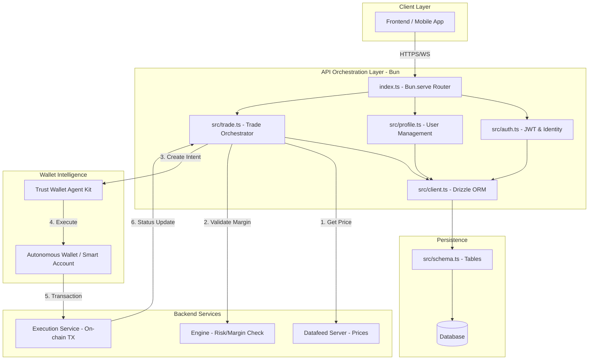

# 🚀 Stashpro API Layer

[](https://bun.sh)
[](https://orm.drizzle.team)
[](LICENSE)

**Stashpro** is a high-performance trading orchestration layer designed for the next generation of DeFi. It serves as the critical gateway between user interfaces and a suite of specialized microservices (Datafeed, Engine, Execution), leveraging **Intent-Based Trading** and **Autonomous Wallets** to remove the friction of manual transaction signing.

---

## 🌟 Key Features

- **⚡ Ultra-Low Latency**: Powered by [Bun](https://bun.sh), utilizing `Bun.serve()` for maximum request throughput and native WebSocket support.
- **🤖 Intent-Based Trading**: Integration with the **Trust Wallet Agent Kit**, allowing users to set trading intents that execute autonomously.
- **🔐 Autonomous Wallet Management**: Support for Smart Accounts, reducing the need for repetitive manual signing while maintaining security.
- **🛡️ Type-Safe Data Layer**: End-to-end type safety using **Drizzle ORM**, ensuring the database schema and application logic stay in sync.
- **⚙️ Microservice Orchestration**: A lean API design that delegates heavy lifting to specialized services (Risk Engine, Price Feeds, On-chain Execution).

---

## 🏗️ System Architecture

Stashpro follows an orchestration pattern. The API layer validates identity and coordinates the flow between the user and the execution pipeline.

### System Design Diagram



---

## 🛠️ Technical Stack

| Component | Technology | Reason |
| :--- | :--- | :--- |
| **Runtime** | `Bun` | Superior performance and native TypeScript support. |
| **Database** | `SQLite` / `Postgres` | High reliability and relational integrity. |
| **ORM** | `Drizzle ORM` | Minimal overhead and full type safety. |
| **Auth** | `JWT` | Stateless, scalable session management. |
| **Wallet Kit** | `Trust Wallet Agent Kit` | State-of-the-art autonomous intent execution. |

---

## 📂 Project Structure

```text
backend/
├── src/
│   ├── auth.ts      # Identity management, JWT issuance, and password hashing.
│   ├── client.ts    # Drizzle DB client and connection pooling.
│   ├── profile.ts   # User account settings, balances, and metadata.
│   ├── schema.ts    # Definitive Drizzle table definitions.
│   └── trade.ts     # Orchestration logic for the trading lifecycle.
├── index.ts         # Main server entry point and route definitions.
├── CLAUDE.md        # Internal technical specifications and developer guide.
└── package.json     # Dependencies and scripts.
```

---

## 🚀 Getting Started

### Prerequisites
- [Bun](https://bun.sh) installed on your machine.

### Installation
1. Clone the repository:
   ```bash
   git clone https://github.com/your-org/stashpro-backend.git
   cd stashpro-backend
   ```

2. Install dependencies:
   ```bash
   bun install
   ```

3. Environment Setup:
   Create a `.env` file in the root directory and add your credentials:
   ```env
   DATABASE_URL=your_db_url
   JWT_SECRET=your_super_secret_key
   AGENT_KIT_API_KEY=your_trust_wallet_key
   ```

### Running the Application
Start the server in development mode with hot-reload:
```bash
bun --hot index.ts
```

---

## 🗺️ Roadmap

### Phase 1: Foundation (Current)
- [x] Implement Drizzle ORM Schema.
- [x] Setup Bun.serve() routing architecture.
- [ ] Implement JWT-based Authentication.
- [ ] Build User Profile and Balance management.

### Phase 2: Trading & Intelligence
- [ ] Integrate Datafeed Server for real-time pricing.
- [ ] Implement Risk Engine validation calls.
- [ la l] Connect Trust Wallet Agent Kit for Autonomous Wallets.
- [ ] Establish asynchronous Trade state updates via Execution Service.

### Phase 3: Optimization & Scale
- [ ] Transition to PostgreSQL for production.
- [ ] Implement Redis caching for price feeds.
- [ ] Advanced telemetry and trading analytics.

---

## 🤝 Contributing

We welcome contributions to Stashpro! Please follow these steps:
1. Fork the Project.
2. Create your Feature Branch (`git checkout -b feature/AmazingFeature`).
3. Commit your Changes (`git commit -m 'Add Some AmazingFeature'`).
4. Push to the Branch (`git push origin feature/AmazingFeature`).
5. Open a Pull Request.

## 📄 License
Distributed under the MIT License. See `LICENSE` for more information.
